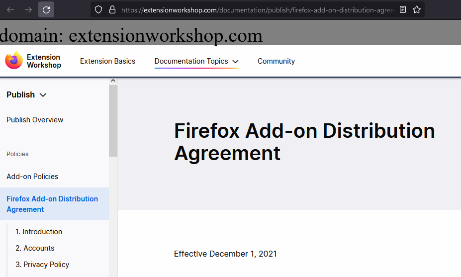
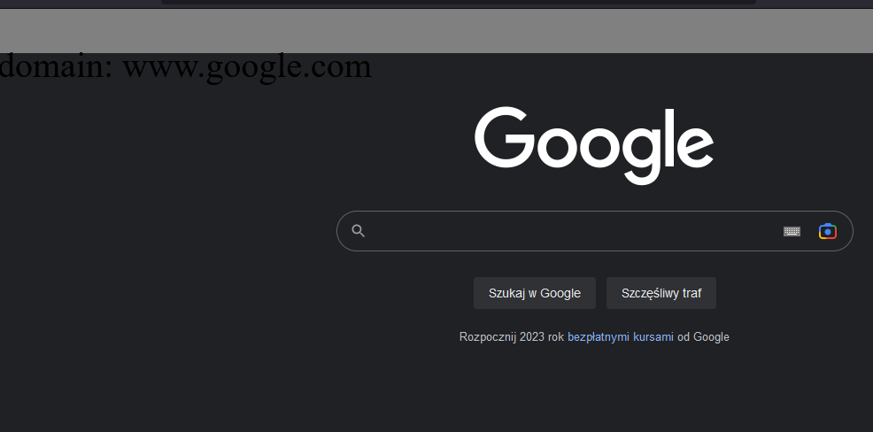

  # Domain Magnifier

## Embrace the power of a unicorn with magnifier! Bolster your phishing defence! 

The add-on is intended to add a bar on the top of the web page and print current domain name on it. If the domain contains some non-standard characters,
then these are bolded.

# Screenshot

# Known bugs
There are pages where the domain name is printed outside the intended place. There are also web pages where the add on breaks some visual features.

